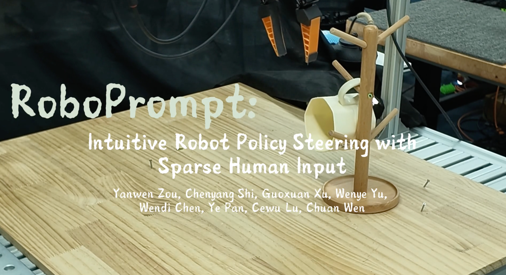

# RoboPrompt



<p align="center">
  <a href="https://yanwen-zou.github.io"><strong>Yanwen Zou</strong></a>,
  <a href="https://shi-akihi.github.io"><strong>Chenyang Shi</strong></a>,
  <a href="https://fluorescex.github.io/"><strong>Guoxuan Xu</strong></a>,
  <a href="https://virlus.github.io"><strong>Wenye Yu</strong></a>,<br>
  <a href="https://wendichen.me"><strong>Wendi Chen</strong></a>,
  <a href="https://whitneypanye.github.io"><strong>Ye Pan</strong></a>,
  <a href="https://www.mvig.org"><strong>Cewu Lu</strong></a><sup>†</sup>, and
  <a href="https://alvinwen428.github.io"><strong>Chuan Wen</strong></a><sup>†</sup>
</p>

<p align="center">
  <a href="https://yanwen-zou.github.io/Roboprompt-Website/">Project website</a> · <a href="">arXiv</a>
</p>

Steer a robot policy with a point, a drawn trajectory, or a motion command. **Phase I (Evo-1)** proposes a prompt-conditioned action chunk; **Phase II (π₀.₅, Diffusion Policy, or FastWAM)** refines it into the final trajectory.

## Quick Start

### Environment: Evo-1 + OpenPI

Here we use OpenPI as a Phase II policy example. For other policies, follow the environment instructions for [Diffusion Policy](diffusion_policy/README.md#-installation) or [FastWAM](FastWAM/README.md#environment-setup).

```bash
git clone https://github.com/yanwen-zou/Roboprompt.git
cd Roboprompt
GIT_LFS_SKIP_SMUDGE=1 uv sync --locked
source .venv/bin/activate
```

This installs the bundled OpenPI, its WebSocket client, and dataset tools. Install PyTorch and the additional Evo-1 training dependencies next; the example uses CUDA 12.8 wheels, so choose a matching CUDA toolkit/driver on your machine:

```bash
uv pip install torch==2.7.1 torchvision==0.22.1 \
  --index-url https://download.pytorch.org/whl/cu128
uv pip install timm accelerate einops diffusers ninja pandas matplotlib \
  deepspeed swanlab av fvcore pyyaml setuptools packaging \
  'transformers==4.53.2'
export CUDA_HOME=/usr/local/cuda  # Set this to your installed CUDA toolkit.
MAX_JOBS=4 uv pip install flash-attn --no-build-isolation
```

Evo-1 initializes its VLM from `OpenGVLab/InternVL3-1B` on first use. OpenPI uses JAX/CUDA from the root environment. Use the activated `python` for the commands below.

For labeling and the interactive evaluation window, install FFmpeg and a GUI-enabled OpenCV build:

```bash
sudo apt-get install -y ffmpeg libgl1 libglib2.0-0
uv pip uninstall opencv-python-headless
uv pip install --reinstall opencv-python==4.13.0.92
```

## Phase I Policy: Data Preparation

Download the labeled bread training data and maze observations from [Roboprompt_Play_Data](https://huggingface.co/datasets/ywzou/Roboprompt_Play_Data):

```bash
hf download ywzou/Roboprompt_Play_Data --repo-type dataset \
  --include "bread/**" "maze/meta/**" "maze/data/**" "maze/videos/**" \
  --local-dir ./data/Roboprompt_Play_Data
```

Use **maze** as the label-generation example.

```bash
export ROBOPROMPT_HARDWARE_CONFIG="$PWD/hardware/config/flexiv.reference.json"
for episode in data/Roboprompt_Play_Data/maze/data/chunk-*/episode_*.parquet; do
  episode_id=$(basename "$episode" .parquet)
  python scripts/labeling/traj_label_rw.py \
    --dataset-dir data/Roboprompt_Play_Data/maze \
    --episode-index "$((10#${episode_id#episode_}))"
done
```

This projects the gripper-tip trajectory into the image and saves `extras/episode_XXXXXX/target_pixels.npy` plus an overlay video. Evo-1 uses these labels to construct point and trajectory prompts during training.

## Phase I Policy Training

Train Evo-1 in two stages: first freeze InternVL3 and train the action head, then resume that checkpoint and train the VLM and action head together.

The single-GPU example presets read the downloaded bread dataset directly (W&B is disabled):

- [Action-head stage](scripts/realworld/train/evo1/config/bread_example_action.yaml): 5,000 steps, frozen VLM.
- [Full-model stage](scripts/realworld/train/evo1/config/bread_example_full.yaml): 30,000 steps, VLM and action head enabled.


```bash
# Shared storage for datasets and checkpoints.
export RP_DATA_ROOT="$PWD/data"
export TIME=$(date +%Y%m%d_%H%M%S)

# Stage 1: train the action head.
python scripts/realworld/train/evo1/train.py --config bread_example_action

# Stage 2: resume Stage 1 and unfreeze the VLM.
python scripts/realworld/train/evo1/train.py --config bread_example_full

export EVO1_CKPT="$RP_DATA_ROOT/evo1/bread_example_full_${TIME}/step_final"
```

Keep the same `TIME` in both commands so Stage 2 finds the Stage 1 checkpoint.

## System Inference

### Offline evaluation

Download the example checkpoints and bread clip (`episode_000000`); no robot is needed:

```bash
hf download ywzou/Roboprompt_Play_Data --repo-type dataset \
  --include "ckpt/evo1_full/**" "ckpt/pi05_toaster/**" --local-dir .
hf download ywzou/Roboprompt_Play_Data --repo-type dataset \
  --include "bread/meta/**" "bread/data/chunk-000/episode_000000.parquet" \
    "bread/videos/chunk-000/*/episode_000000/episode_000000.mp4" \
  --local-dir ./data/offline_example
```

**Terminal 1 — steering server** (from the repository root):

```bash
source .venv/bin/activate
export RP_DATA_ROOT="$PWD/data"
export EVO1_CKPT="$PWD/ckpt/evo1_full"
export PI05_CKPT="$PWD/ckpt/pi05_toaster"
export PI05_CONFIG=pi05_flexiv_toaster_right_dagger1
export XLA_PYTHON_CLIENT_MEM_FRACTION=0.5
bash scripts/realworld/eval/evo1/server/steer_server_openpi.sh
```

**Terminal 2 — interactive visualization** (from the repository root, with a display):

```bash
source .venv/bin/activate
export ROBOPROMPT_HARDWARE_CONFIG="$PWD/hardware/config/flexiv.reference.json"
python scripts/realworld/eval/evo1/vis_prompt_denoise.py data/offline_example/bread \
  --host 127.0.0.1 --port 8000 --seed 0 \
  --num-direct 8 --phase2-steps 0.6 \
  --save-dir output/offline_eval
```

1. The client samples a timestep and displays the environment/wrist observations.
2. Add a point or draw a trajectory on the image, or adjust the motion controls. Press **Enter** to submit the prompt. Use **Backspace** to undo a drawing; **[ / ]** adjust the refinement control.
3. The comparison shows **unprompted Phase II samples on the left**, and **Evo-1's Phase I trajectory plus the final Phase I + II trajectory on the right**.
4. Press **P** for another timestep, or **Q / Esc** to quit. Comparison images are saved to `output/offline_eval/`.

`--phase2-steps` accepts a fractional step count for OpenPI. Smaller values preserve more of Evo-1's proposal; larger values allow more downstream refinement.

## Repository Layout

| Path | Contents |
| --- | --- |
| `Evo-1/` | Phase I model, prompt-conditioned dataset loader, and training implementation |
| `openpi/` | π₀.₅ downstream policy and training configs |
| `FastWAM/`, `diffusion_policy/` | Alternative Phase II policies |
| `scripts/labeling/` | Real-world trajectory labeling |
| `scripts/realworld/train/evo1/` | Two-stage Evo-1 training launchers and YAML configs |
| `scripts/realworld/eval/` | Interactive offline evaluation and policy server/client launchers |
| `steering/` | Phase I + Phase II composition and policy adapters |
| `hardware/` | Robot/camera integration and calibration configs |
| `web_steer/` | Browser-based prompt interface |
| `pics/` | README cover image |
